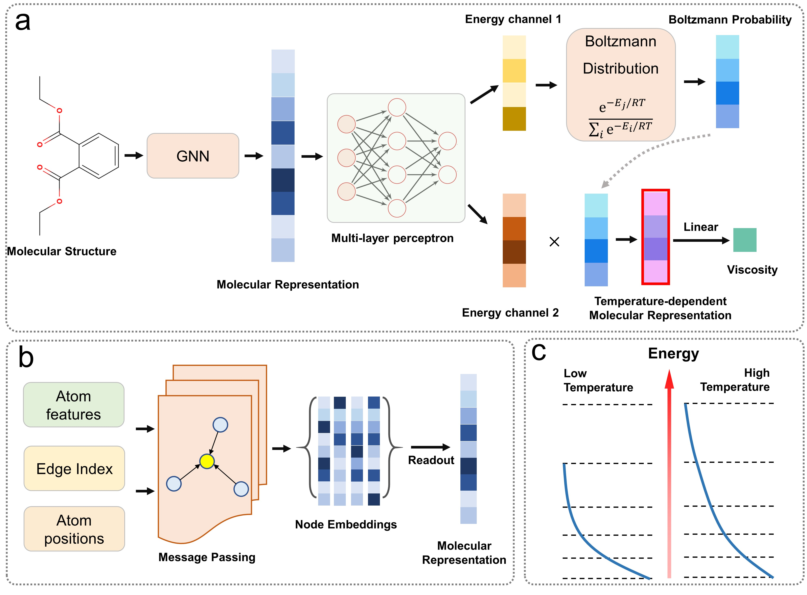

# Official Code for "Learning Temperature-dependent Molecular Representations for the Viscosity Predictions of Organic Liquids"



## Run
1. Make empty folders named "checkpoints"/"logs"/"pred_results" under results folder
2. Install the required packages `pip install -r requirements.txt`
3. Run. `python run.py` or `python run_mixture.py`

## Citation
```Waiting...```
